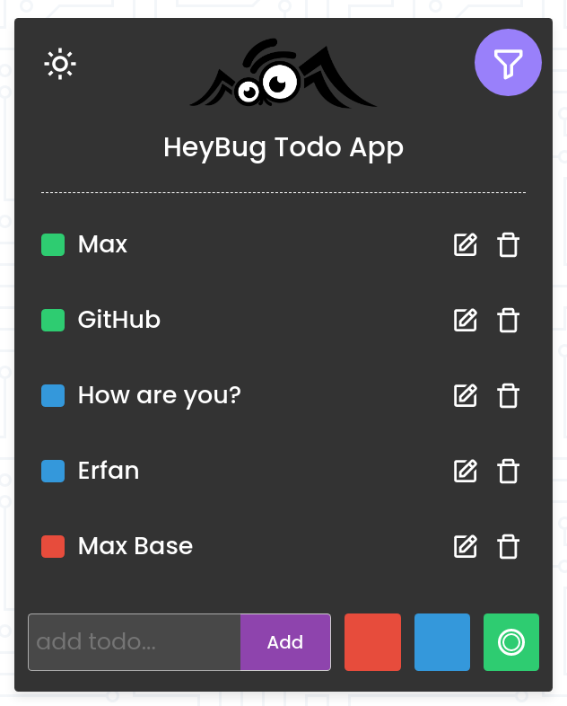

# Todo App Mithril JS

I love js and mithril so it's why i started to create a Todo-list project using mithril js something is one of best js-based SPA framework.

## Preview

You can check preview of the project [here](https://basemax.github.io/TodoAppMithrilJS/).

### Demo Screenshots

| White | Black |
| :---: | :---: |
|  |  | 

## TODO

- Support **dark** theme

## Credit

- **Arthur**: showed me what was my mistake at `ContainerComponent`
- **Patrik**: help and guide
- **Oscar**: teached me more deeply about MIthrilJS
- **Erfan**: UI/Logo licensed under him and not allowed for public using

And again thanks from Mithril team members.

© Copyright Max Base, 2021
